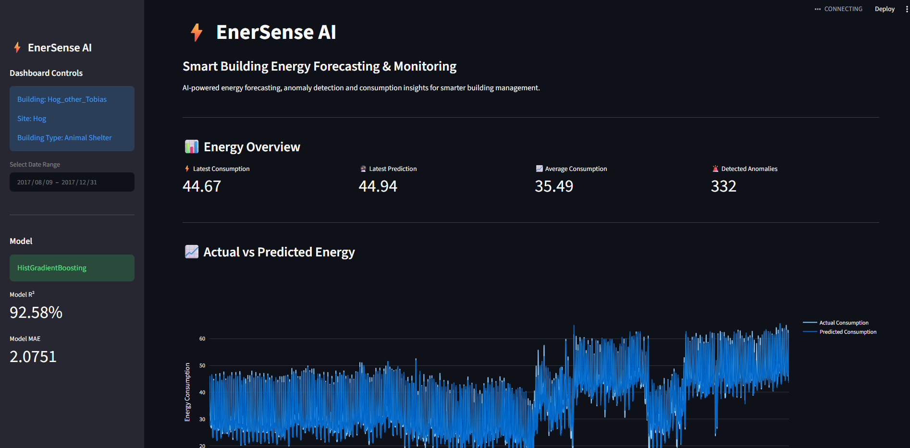
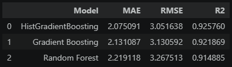

# ⚡ EnerSense AI

### AI-Powered Building Energy Forecasting & Anomaly Detection

EnerSense AI is a machine learning project designed to forecast building electricity consumption, analyze energy usage patterns, and identify unusual consumption behavior.

The project combines historical electricity consumption, weather conditions, and time-based features to build an intelligent energy forecasting system.

---

## 📌 Project Overview

Building energy consumption changes according to time, weather, operational patterns, and historical demand.

EnerSense AI uses historical hourly electricity consumption along with weather and temporal features to:

- Forecast hourly electricity consumption
- Analyze energy consumption patterns
- Detect unusual consumption points
- Compare machine learning models
- Identify the most important prediction features
- Provide an interactive Streamlit dashboard

The project focuses on a selected building:

**Building:** `Hog_other_Tobias`  
**Site:** `Hog`  
**Building Type:** `Animal Shelter`  
**Area:** `2,220.7 m²`

---

## 🎯 Objectives

The main objectives of this project are:

1. Analyze historical building electricity consumption.
2. Study energy consumption patterns over time.
3. Integrate electricity and weather data.
4. Handle missing values and prepare the dataset.
5. Perform exploratory data analysis.
6. Detect potential energy consumption anomalies.
7. Engineer time-series and lag-based features.
8. Train multiple machine learning models.
9. Compare model performance.
10. Develop an interactive energy monitoring dashboard.

---

## 📊 Dataset

The project uses three major datasets:

### 1. Electricity Data

Hourly electricity consumption data was used for the selected building.

**Selected meter:**

`Hog_other_Tobias`

**Original readings:**

`17,544`

**Missing values:**

`0%`

---

### 2. Building Metadata

Building-level information includes:

- Building ID
- Site ID
- Primary space usage
- Sub-primary space usage
- Building area
- Latitude
- Longitude
- Timezone
- Electricity availability
- Year built
- EUI
- Site EUI
- Source EUI
- Other building characteristics

Selected building information:

| Attribute | Value |
|---|---|
| Building | Hog_other_Tobias |
| Site | Hog |
| Primary Usage | Other |
| Sub Usage | Animal Shelter |
| Area | 2,220.7 m² |
| Electricity | Yes |
| EUI | 76.4 |
| Site EUI | 161.3 |
| Source EUI | 75.1 |
| Timezone | US/Central |

---

### 3. Weather Data

Weather information was integrated using the building's site.

Important weather variables include:

- Air Temperature
- Dew Temperature
- Precipitation
- Sea Level Pressure
- Wind Direction
- Wind Speed
- Cloud Coverage

---

## 🧹 Data Cleaning

The initial merged dataset contained:

**Shape:**

`(17,544, 11)`

Missing values were found in several weather variables.

Missing values were handled during preprocessing.

The cleaned dataset contains:

**Shape:**

`(17,544, 15)`

Remaining missing values:

`0`

The final dataset contains:

- Timestamp
- Energy Consumption
- Site ID
- Weather features
- Hour
- Day
- Day of week
- Month
- Year
- Weekend indicator

---

## 🔎 Exploratory Data Analysis

Several analyses were performed to understand energy consumption behavior.

### Energy Consumption Summary

| Statistic | Value |
|---|---:|
| Mean | 37.50 |
| Median | 36.05 |
| Minimum | 8.83 |
| Maximum | 76.70 |
| Standard Deviation | 12.50 |

### Key EDA Findings

- Energy consumption varies significantly throughout the year.
- Consumption shows clear hourly patterns.
- Energy demand is generally higher during morning and evening periods.
- Weekday average consumption is slightly higher than weekend consumption.
- Energy consumption changes with temperature and seasonal conditions.
- Monthly consumption shows noticeable variation across the two-year period.

---

## 🕐 Hourly Consumption Pattern

The analysis shows a strong daily consumption pattern.

Higher average consumption was observed around:

- **06:00**
- **07:00**
- **18:00**
- **19:00**

Lower consumption was generally observed during:

- Early morning
- Late evening

This indicates that time-based features are important for forecasting energy demand.

---

## 📅 Daily & Monthly Analysis

Daily and monthly aggregation was performed to identify long-term consumption trends.

The analysis covered:

**January 2016 → December 2017**

Monthly consumption showed noticeable seasonal changes, with higher and lower consumption periods across the year.

---

## 🌦️ Weather Analysis

Weather variables were analyzed against electricity consumption.

Correlation with energy consumption:

| Feature | Correlation |
|---|---:|
| Air Temperature | -0.4798 |
| Dew Temperature | -0.4544 |
| Month | -0.2291 |
| Sea Level Pressure | 0.1055 |
| Wind Direction | 0.1025 |
| Hour | 0.0805 |
| Wind Speed | 0.0583 |
| Precipitation | -0.0366 |
| Is Weekend | -0.0468 |

Air temperature showed the strongest negative correlation among the analyzed variables.

---

## 🚨 Anomaly Detection

Potential unusual energy consumption points were identified using an IQR-based approach.

### Results

- Lower Bound: `-2.03`
- Upper Bound: `75.02`
- Potential anomalies: `2`
- Anomaly percentage: `0.01%`

Example high-consumption observations included:

| Timestamp | Energy Consumption |
|---|---:|
| 2016-01-31 05:00 | 76.700 |
| 2016-04-13 19:00 | 75.889 |

These observations can be investigated further to determine whether they were caused by operational activity, weather conditions, equipment behavior, or other factors.

---

# 🧠 Feature Engineering

Time-series features were created to improve forecasting performance.

### Temporal Features

- `hour`
- `day`
- `day_of_week`
- `month`
- `year`
- `is_weekend`

### Lag Features

- `lag_1h`
- `lag_2h`
- `lag_24h`
- `lag_168h`

### Rolling Features

- `rolling_24h`
- `rolling_168h`

These features allow the models to learn relationships between current consumption and previous consumption patterns.

---

# 🤖 Machine Learning

Three machine learning models were evaluated:

1. Random Forest
2. Gradient Boosting
3. HistGradientBoosting

The data was split chronologically to preserve the time-series structure.

### Dataset Split

| Dataset | Samples |
|---|---:|
| Training | 13,900 |
| Testing | 3,476 |
| Total | 17,376 |

### Training Period

`2016-01-08 00:00:00`

to

`2017-08-09 03:00:00`

### Testing Period

`2017-08-09 04:00:00`

to

`2017-12-31 23:00:00`

---

# 📈 Model Performance

| Model | MAE | RMSE | R² |
|---|---:|---:|---:|
| **HistGradientBoosting** | **2.0751** | **3.0516** | **0.9258** |
| Gradient Boosting | 2.1311 | 3.1306 | 0.9219 |
| Random Forest | 2.2191 | 3.2675 | 0.9149 |

## 🏆 Best Model

**HistGradientBoosting**

Performance:

- **MAE:** 2.0751
- **RMSE:** 3.0516
- **R²:** 0.9258
- **R² Score:** 92.58%

The model achieved the best performance among the evaluated models.

---

# 🔍 Feature Importance

The most important features for the selected forecasting model were:

| Feature | Importance |
| `lag_24h` | 0.6628 |
| `lag_1h` | 0.2522 |
| `rolling_24h` | 0.0192 |
| `lag_2h` | 0.0129 |
| `lag_168h` | 0.0119 |
| `hour` | 0.0110 |

### Key Insight

Historical energy consumption is the strongest predictor of future consumption.

In particular, `lag_24h` contributed approximately **66.3%** of the model's feature importance, showing the importance of previous-day consumption patterns.

---

# 📉 Prediction Error Analysis

The selected HistGradientBoosting model produced:

- **Average Absolute Error:** 2.0751
- **Maximum Absolute Error:** 24.4964

Most predictions remain relatively close to the actual consumption values, while larger errors can help identify periods requiring additional investigation.

---

# 📊 Interactive Dashboard

EnerSense AI includes a Streamlit dashboard for interactive energy monitoring.

The dashboard provides:

- Energy consumption overview
- Actual vs predicted consumption
- Daily energy consumption
- Prediction error analysis
- Anomaly monitoring
- Building information
- Model performance
- Feature information
- Energy insights

### Dashboard Preview

### Actual vs Predicted Energy

### Anomaly Monitoring

### Daily Energy Consumption

### Model Comparison

---

# 🗂️ Project Structure

EnerSense-AI/
│
├── DASHBOARD/
│   └── app.py
│
├── DATA/
│   ├── electricity_cleaned.csv
│   ├── metadata.csv
│   ├── weather.csv
│   └── energy_predictions.csv
│
├── IMAGES/
│   ├── dashboard.png
│   ├── actual_vs_predicted_energy.png
│   ├── anomaly monitoring.png
│   ├── daily avg energy_consumption.png
│   └── model_comparison.png
│
├── MODELS/
│   ├── enerSense_histgradient_model.pkl
│   └── model_features.pkl
│
├── NOTEBOOK/
│   └── EnerSense_AI.ipynb
│
├── SRC/
│   ├── __init__.py
│   ├── data_preprocessing.py
│   ├── feature_engineering.py
│   ├── anomaly_detection.py
│   └── model_utils.py
│
├── .gitignore
├── REQUIREMENT.txt
└── README.md

# 🛠️ Technologies Used

- Python
- Pandas
- NumPy
- Scikit-learn
- Matplotlib
- Plotly
- Streamlit
- Jupyter Notebook
- Git & GitHub

---

# 🚀 How to Run the Project

## 1. Clone the Repository

git clone https://github.com/ashfiya015-stack/EnerSense-AI.git
cd EnerSense-AI

## 2. Install Dependencies
pip install -r requirement.txt

## 3. Run the Dashboard
streamlit run DASHBOARD/app.py

